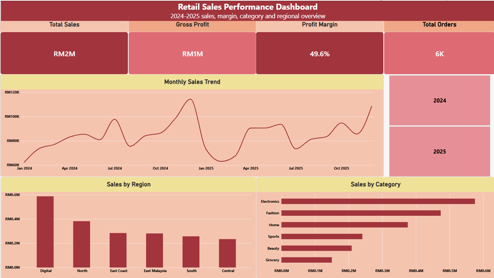
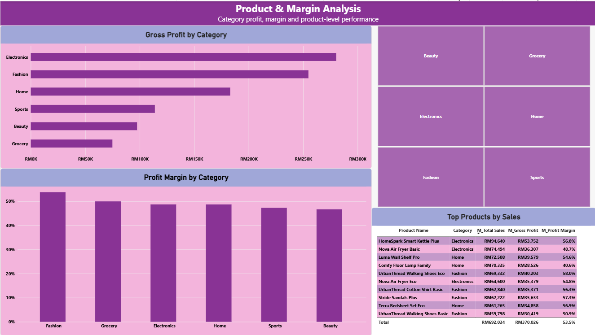
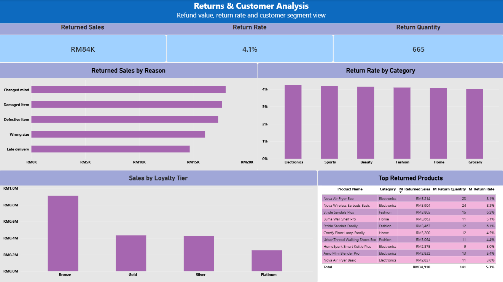

# Retail Sales Performance Dashboard

An interactive **Microsoft Power BI** portfolio project analysing retail sales performance across **2024–2025**, with a focus on revenue, profitability, product performance, regional performance, returns and customer loyalty.

---

## Project Overview

This project presents a three-page business intelligence dashboard designed to transform retail transaction data into a clear and actionable view of business performance.

The report is structured around three analytical areas:

1. **Executive Overview** — high-level sales, profitability and regional performance
2. **Product & Margin Analysis** — category and product-level profitability
3. **Returns & Customer Analysis** — product returns and customer loyalty performance

The Power BI semantic model uses separate fact and dimension tables to support structured analysis across sales, returns, targets, customers, products, dates and stores.

---

## Dashboard Preview

### 1. Executive Overview



Provides a management-level overview of retail sales performance across 2024–2025.

**Key metrics and analysis:**
- Total Sales
- Gross Profit
- Profit Margin
- Total Orders
- Monthly Sales Trend
- Sales by Region
- Sales by Category
- Year filtering for 2024 and 2025

---

### 2. Product & Margin Analysis



Focuses on category profitability and product-level commercial performance.

**Key analysis:**
- Gross Profit by Category
- Profit Margin by Category
- Category-level performance comparison
- Top Products by Sales
- Product-level Sales
- Gross Profit
- Profit Margin

---

### 3. Returns & Customer Analysis



Explores product return behaviour and customer purchasing patterns.

**Key metrics and analysis:**
- Returned Sales
- Return Rate
- Return Quantity
- Returned Sales by Reason
- Return Rate by Category
- Sales by Loyalty Tier
- Top Returned Products

---

## Data Model

The Power BI semantic model is structured using separate fact and dimension tables.

### Fact Tables

- `factSales`
- `factReturns`
- `factTargets`

### Dimension Tables

- `dimCustomer`
- `dimDate`
- `dimProduct`
- `dimStore`

This dimensional structure separates transactional data from descriptive attributes and enables reusable measures across multiple areas of the report.

---

## Measures Used

The report uses dedicated Power BI measures including:

- `M_Total Sales`
- `M_Gross Profit`
- `M_Profit Margin`
- `M_Total Orders`
- `M_Returned Sales`
- `M_Return Rate`
- `M_Return Quantity`

These measures support consistent KPI calculations throughout the dashboard.

---

## Business Questions Addressed

The dashboard is designed to answer business questions such as:

- How are total sales and gross profit performing?
- How does sales performance change over time?
- Which product categories contribute the most revenue?
- Which categories generate the highest gross profit?
- Which categories achieve the strongest profit margins?
- Which regions contribute the most sales?
- Which individual products generate the highest sales?
- What is the total value of returned sales?
- What are the most common reasons for product returns?
- Which categories experience higher return rates?
- Which products have the highest return activity?
- How does sales performance differ across customer loyalty tiers?

---

## Tools & Skills Demonstrated

### Business Intelligence

- Microsoft Power BI Desktop
- Dashboard Design
- KPI Development
- Interactive Reporting
- Business Intelligence Analysis

### Data Modelling

- Fact and Dimension Tables
- Data Relationships
- Dimensional Data Modelling
- Semantic Modelling

### Data Analysis

- Sales Analysis
- Profitability Analysis
- Product Performance Analysis
- Regional Performance Analysis
- Returns Analysis
- Customer Segmentation Analysis

### Technical Skills

- DAX Measures
- Data Visualisation
- Data Modelling
- Interactive Slicers
- KPI Reporting

---

## Repository Structure

```text
PowerBI-Retail-Sales-Performance-Dashboard/
│
├── README.md
├── Retail-Sales-Performance-Dashboard.pbix
├── executive-overview.png
├── product-margin-analysis.png
└── returns-customer-analysis.png
```

---

## How to View the Dashboard

GitHub cannot render `.pbix` files directly.

To explore the full interactive dashboard:

1. Download the `Retail-Sales-Performance-Dashboard.pbix` file from this repository.
2. Open the file using **Microsoft Power BI Desktop**.
3. Navigate through the three report pages:
   - Executive Overview
   - Product & Margin Analysis
   - Returns & Customer Analysis
4. Use the available slicers and visual interactions to explore the data.

The dashboard screenshots included in this README provide a preview of the report without requiring Power BI Desktop.

---

## Future Enhancement

The semantic model also contains a `factTargets` table, providing an opportunity to extend the dashboard with target-based performance analysis.

Potential future enhancements include:

- Actual Sales vs Sales Target
- Sales Variance
- Variance %
- Target Achievement %
- Performance against business targets
- Additional drill-through analysis
- Expanded interactive filtering

---

## Author

**Ismail Md Zani**  
Final-Year Mathematics Undergraduate  
Universiti Teknologi Malaysia (UTM)

Interested in applying data analytics, business intelligence and quantitative methods to real-world business problems.

- **GitHub:** https://github.com/ismailmdzani
- **LinkedIn:** https://www.linkedin.com/in/ismail-md-zani-4b169a395/

---

## Project File

The complete interactive Power BI report is available in this repository:

`Retail-Sales-Performance-Dashboard.pbix`

Download and open it using **Microsoft Power BI Desktop** to explore the full dashboard.
